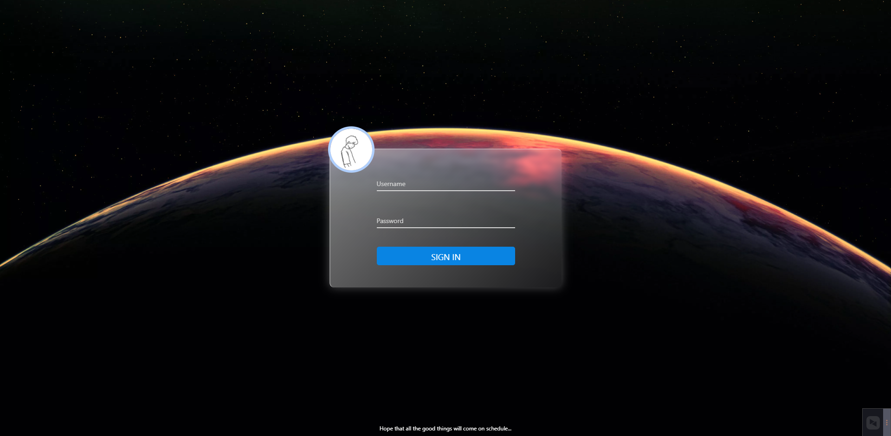
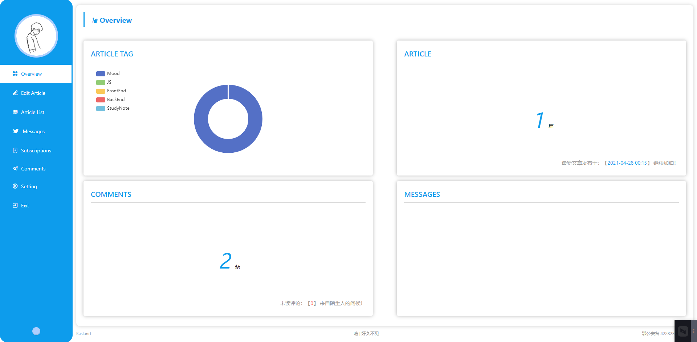
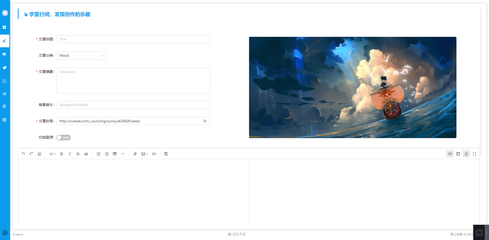
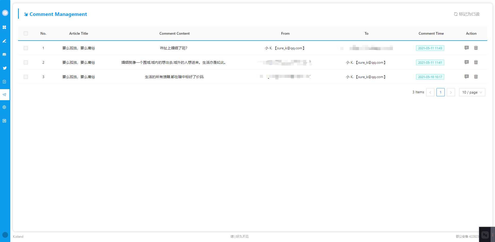

# 
K.island

    
    
    
     
    
    
    
    
    
     
    
    
    
    

## 🏴‍☠️ ONE PIECE

## 👻 好戏开场了

均尝试使用 TS（typeScript 4.x） 编写（初次尝试，问题不少，不清楚如何定义类型之后：@ts-ignore || any 永远的神🤣 —— 虽然不是好的解决方案）

> - web：
>   + nuxtjs + @nuxt/composition-api: 构建时基于 vue2.x
>   + @nuxtjs/axios：服务端数据请求
>   + marked + highlight.js + 自定义样式：解析文本内容
>   + WebGL 代码实现首页雨幕效果
>   + glslify：用于 GLSL 的 node.js 样式的模块系统
>   + gsap：专业级动画库
>   + nprogress：加载进度条
>   + qrcode：二维码生成器
>   + 交互组件（未使用 UI 框架，用到的组件通过自定义实现，如 Modal，Notification...）
> 
> - admin：
>   + 起始使用 vue-cli 构建（已移除），改用 vite 重新构建后台项目
>   + vue 3.x + vuex 4.x + vue-router 4.x 全家桶
>   + echarts 5.x 图表库，简单封装 VueEcharts 组件自使用
>   + ant-design-vue 2.x 组件库（按需引入）
>   + @kangc/v-md-editor 文章 markdown 文本编辑器（之前用 marked + highlight.js 自封装一个，奈何功能简陋，遂弃之）
> 
> - server：
>   + express 构建服务
>   + mysql2 与数据库交互进行数据的增删改查
>   + cors 配置跨域许可
>   + multer 进行文件存储（项目用于存储文章首页配图）
>   + jsonwebtoken 颁发 token 与验证
>   + nodemailer 发送邮件
>
> - database：
>   + *.sql   MySQL 数据库表结构

## 🤩 才艺展示

- `WEB 端`

    - [x] 首页雨幕效果（HOME)  →  WebGl 代码实现，模拟下雨雨滴飞溅在玻璃上的效果
    - [x] 首页文章查询（HOME），按浏览量排序
    - [x] 文章列表页（ARTICLE），按文章发布时间倒序排序，并按年月进行分组渲染
    - [x] 网站订阅（SUBSCRIPTION），输入邮箱进行网站订阅（仅用于 小K. 发布新文章后邮件的通知，需验证邮箱，取消订阅则需要联系 小K. 在后台系统取消）
    - [x] Header 背景音乐（暂只支持 audio 标签支持的音乐源，本服务器上部署后 Nginx 代理路径尚有问题）
    - [x] 回到顶部组件
    - [x] 明暗主题切换
    - [x] 响应式页面布局
    - [x] 加载更多内容（通过按钮点击或滚动到页面底部触发）
    - [x] 发表评论与回复评论（邮箱正确填写会收到评论或回复提示信息，但 小K. 经测试 outlook 会把此邮件分类为垃圾邮件🤣 咱能说啥呢）
    - [ ] 邮箱订阅验证成功，跳回网站首页（待做）
    - [ ] 文章点赞（暂取消）

- `ADMIN 端`

    - [x] 文章信息概览
    - [x] 新增 / 修改文章
    - [x] 文章列表管理（删除文章时同步删除此文章所有评论：待做）
    - [x] 评论管理
    - [x] 留言管理
    - [x] 订阅管理
    - [ ] 网站信息配置（待定）

- `SERVER 端`

    - [x] http 请求处理，数据库数据交互

## 🤪 效果图

- WEB 端直接去网站看吧，就不贴图了 → [suressk.com](http://suressk.com)

- ADMIN 端

    

    
    
    
    
    

## 🙃 目录说明

因为 Docker 部署我还未成功尝试，直接忽略即可（admin，server，web 除外）

- config：准备使用 Docker 部署项目的 Nginx 配置（忽略）
- docker-compose.yml 及 admin，server，web 目录下的 Dockerfile 文件：docker 部署的执行文件（忽略）
- docImgs：README.md 文件插图文件夹
- database：MySQL 创建表的 sql 文件

## 💯 古言古语

> 一身清贫不敢入繁尘，
> 两袖清风怎敢误佳人。
> 三餐不定岂敢旭高堂，
> 四季漂泊哪敢言家成。

> 看日夜更替，看四季更迭。
> 看花开花落，看云卷云舒。

> 时光只能催人老，
> 不信多情，长恨离亭，
> 泪滴春衫酒易醒。

> 珍惜所有的不期而遇，看淡所有的不辞而别。

## 😍 要请我喝杯咖啡吗？

    
    

<!--  -->

<!--  -->
