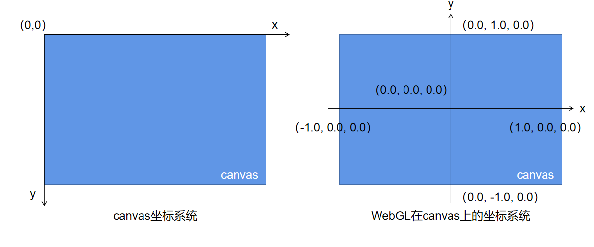

# WebGL {ignore=true}

[toc]

## 基础概念

1. WebGL 绘制的基本图源：`点`、`线段（线带）`、`三角形（三角带，三角扇区）`

2. 顶点着色器： 用来描述顶点特征的程序

    内置变量：

    ```GLSL
    vec4 gl_Position // 表示顶点位置，必须被赋值（否则无法正常工作）
    float gl_PointSize // 表示点的尺寸（像素值）默认 1.0
    ```

3. 片元着色器： 进行逐片元处理过程的程序（如光照）

    内置变量:

    ```GLSL
    vec4 gl_FragColor // 指定片元颜色（RGBA 格式）RGBA 数值取值范围： 0 <= value <= 1; 数值大于 1 与 1 等效; 小于 0 等效于 0.
    ```

4. WebGL 绘制流程

    + 获取 WebGL 绘图上下文 ```const gl = canvasDom.getContext('webgl');```
    + 初始化着色器（顶点着色器，片元着色器）
    + 设置点的坐标信息
    + 设置 `<canvas>` 背景色
    + 清空 `<canvas>`
    + 进行绘制

5. 着色器的变量声明方式 —— 存储限定符

    > - `attribute`: 传输的是与顶点（单独的顶点）相关的数据。
    > - `uniform`: 传输的是与所有顶点都相关（或与顶点无关）的数据（相当于是全局变量）。
    > - `textures`: 纹理（一个数据序列，可以在着色程序运行中随意读取其中的数据。大多数情况存放的是图像数据，但是纹理仅仅是数据序列，也可以随意存放除了颜色以外的其他数据）。
    > - `varying`: 可变变量是一种顶点着色器给片元着色器传值的方式，依照渲染的图元是点，线段还是三角形，顶点着色器中设置的可变量会在片元着色器运行中获取不同的插值。

6. GLSL ES变量类型

<table>
    <thead style="text-align: center;background-color: #d5d5d5">
        <tr>
            <th>类别</th>
            <th>GLSL ES变量类型</th>
            <th>描述</th>
        </tr>
    </thead>
    <tbody style="text-align: left;">
        <tr>
            <th rowspan="3">矢量</th>
            <td>vec2、vec3、vec4</td>
            <td>具有2、3、4个浮点数的矢量</td>
        </tr>
        <tr>
            <td>ivec2、ivec3、ivec4</td>
            <td>具有2、3、4个整型元素的矢量</td>
        </tr>
        <tr>
            <td>bvec2、bvec3、bvec4</td>
            <td>具有2、3、4个boolean元素的矢量</td>
        </tr>
        <tr>
            <th>矩阵</th>
            <td>mat2、mat3、mat4</td>
            <td>2*2、3*3、4*4 的浮点数矩阵</td>
        </tr>
    </tbody>
</table>

7. 坐标系统区别

    - `<canvas>` 坐标系统：与网页坐标系统一致（canvas 元素左上角为 (0, 0) 点，单位长度为 1 个像素值(即1px)）
    - `WebGL` 坐标系统：为空间直角坐标系，原点在 `canvas 元素` 正中心位置，区间范围为 `[-1, 1]`

    - 坐标转换：

        ```glsl
        // (x + 1) / 2 = canvasPosition.x / canvasWidth
        // (1 - y) / 2 = canvasPosition.y / canvasHeight
        // a_position => canvas 坐标系统点的坐标
        // screenSize => canvas 画布的尺寸
        float x = a_position.x * 2.0 / screenSize.x - 1.0;
        float y = 1.0 - (a_position.y * 2.0 / screenSize.y);
        ```

    如下图所示：

    

8. 获取声明的变量及变量赋值

    ```js
    // GLSL 声明的变量 如：
    // attribute vec2 a_position;
    // uniform vec2 screenSize;
    const a_position = gl.getAttribLocation(program, 'a_position');
    const screenSize = gl.getUniformLocation(program, 'screenSize');

    // 将数据 (v0, v1, v2) 传给 location 参数指定的 attribute 变量
    // gl.vertexAttrib3f(location, v0, v1, v2); // vertexAttrib2f / vertexAttrib4f
    // gl.uniform2f(location, v0, v1); // uniform3f / uniform4f

    // 赋值
    gl.vertexAttrib2f(a_position, x, y);
    gl.uniform2f(screenSize, canvasDom.width, canvasDom.height);
    ```

    WebGL 函数命名同 OpenGL，由三部分组成，以 `gl.vertexAttrib3f(location, v0, v1, v2)` 为例：

    - 基础函数名：`gl.vertexAttrib`
    - 参数个数：`3` → 即：`v0, v1, v2` 这三个参数
    - 参数类型：`f (浮点型)`；`i (整型)`

9. 精度限定字 （片元着色器中的float类型没有默认精度）

<table>
    <thead style="text-align: center;">
        <tr>
            <th rowspan="2">精度限定字</th>
            <th rowspan="2">描述</th>
            <th colspan="2">默认数值范围</th>
        </tr>
        <tr>
            <th>float</th>
            <th>int</th>
        </tr>
    </thead>
    <tbody>
        <tr>
            <th style="text-align: center;">highp</th>
            <td>高精度，顶点着色器的最低精度</td>
            <td>(-2^62, 2^62) 精度 2^-16</td>
            <td>(-2^16, 2^16)</td>
        </tr>
        <tr>
            <th style="text-align: center;">mediump</th>
            <td>中精度，片元着色器的最低精度</td>
            <td>(-2^14, 2^14) 精度 2^-10</td>
            <td>(-2^10, 2^10)</td>
        </tr>
        <tr>
            <th style="text-align: center;">lowp</th>
            <td>低精度，可以表示所有颜色</td>
            <td>(-2, 2) 精度 2^-8</td>
            <td>(-2^8, 2^8)</td>
        </tr>
    </tbody>
</table>

## Example

### 一、绘制点

1. 初始化着色器：

    ```glsl
    // 顶点着色器 vertex
    // attribute vec4 a_position; // 存储限定符 变量类型 变量名;
    void main() {
        gl_Position = vec4(0, 0, 0, 1);
        gl_PointSize = 10.0;
    }
    // 片元着色器 fragment
    void main() {
        gl_FragColor = vec4(0, 0.5, 0.5, 1);
    }
    ```

2. 创建着色器：

    ```js
    // 1. 创建着色器
    const shader = gl.createShader(type); // type: gl.VERTEX_SHADER / gl.FRAGMENT_SHADER

    // 2. 向着色器中添加资源
    gl.shaderSource(shader, source);
    // source 添加的程序（string类型的 GLSL 代码）

    // 3. 编译着色器代码
    gl.compileShader(shader); // shader 要编译的着色器

    const success = gl.getShaderParameter(shader, gl.COMPILE_STATUS); // 着色器编译状态
    gl.getShaderInfoLog(shader); // 着色器状态信息
    ```

3. 创建程序：

    ```js
    // 1. 创建程序
    const program = gl.createProgram();

    // 2. 绑定着色器程序
    gl.attachShader(program, shader);

    // 3. 连接着色器程序
    gl.linkProgram(program);
    ```

4. 清空画布：

    ```js
    gl.clearColor(0, 0.5, 0.5, 1); // 蓝绿色填充画布区域
    gl.clear(gl.COLOR_BUFFER_BIT); // 清空颜色缓冲区
    ```

5. 绘制图形：

    ```js
    // 执行顶点着色器，按照 mode 参数指定的方式绘制图形
    gl.drawArrays(mode, first, count);

    // 1. mode: gl.POINTS / gl.LINES / gl.LINE_STRIP / gl.TRIANGLES / gl.TRIANGLE_STRIP / gl.TRIANGLE_FAN 非这些类型会报错 INVALID_ENUM
    // 点、线、线带、三角形、三角带、三角扇区
    // 2. first: 从哪个顶点开始绘制 (int) 传负数会报错 INVALID_VALUE
    // 3. count: 绘制需要用到多少个点 (int) 传负数会报错 INVALID_VALUE
    ```

+ 完整示例代码：

    ```html
    <canvas width="500" height="500" id="oCanvas"></canvas>
    <!--
        传递点坐标绘制点
        <script type="notjs" id="vertex">
            attribute vec2 a_position;
            uniform vec2 screenSize;
            void main() {
                float x = a_position.x * 2.0 / screenSize.x - 1.0;
                float y = 1.0 - (a_position.y * 2.0 / screenSize.y);
                gl_Position = vec4(x, y, 0, 1);
                gl_PointSize = 10.0;
            }
        </script>
        <script type="notjs" id="fragment">
            void main() {
                gl_FragColor = vec4(1, 0.5, 0, 1);
            }
        </script>
    -->

    <!--
        传递点坐标及点颜色值进行绘制
        片元着色器浮点数无默认精度，需通过 precision mediump float; 指定精度（此处指定中精度）
        片元着色器变量值需通过顶点着色器变量传递赋值 a_color => v_color
    -->
    <script type="notjs" id="vertex">
        attribute vec2 a_position;
        uniform vec2 screenSize;
        attribute vec4 a_color;
        varying vec4 v_color;
        void main() {
            float x = a_position.x * 2.0 / screenSize.x - 1.0;
            float y = 1.0 - (a_position.y * 2.0 / screenSize.y);
            gl_Position = vec4(x, y, 0, 1);
            gl_PointSize = 10.0;
            v_color = a_color;
        }
    </script>
    <script type="notjs" id="fragment">
        precision mediump float;
        varying vec4 v_color;
        void main() {
            gl_FragColor = v_color;
        }
    </script>

    <script>
        const canvasDom = document.getElementById('oCanvas');
        const gl = canvasDom.getContext('webgl');
        if (!gl) {
            alert("Your browser isn't support WebGL!");
        }
        // 获取 GLSL 代码 string 文本
        const vertexStr = document.getElementById('vertex').innerText;
        const fragStr = document.getElementById('fragment').innerText;

        // 创建着色器
        function createShader(gl, type, sourceStr) {
            const shader = gl.createShader(type);
            gl.shaderSource(shader, sourceStr);
            gl.compileShader(shader);
            const success = gl.getShaderParameter(shader, gl.COMPILE_STATUS);
            if (success) {
                return shader;
            }
            console.error(gl.getShaderInfoLog(shader));
        }

        const vertexShader = createShader(gl, gl.VERTEX_SHADER, vertexStr);
        const fragmentShader = createShader(gl, gl.FRAGMENT_SHADER, fragStr);

        // 创建程序
        function createProgram(gl, vertexShader, fragmentShader) {
            const program = gl.createProgram();
            gl.attachShader(program, vertexShader);
            gl.attachShader(program, fragmentShader);
            gl.linkProgram(program);
            return program;
        }
        const program = createProgram(gl, vertexShader, fragmentShader);
        gl.useProgram(program);

        // 获取变量
        const a_position = gl.getAttribLocation(program, 'a_position');
        const screenSize = gl.getUniformLocation(program, 'screenSize');
        gl.uniform2f(screenSize, canvasDom.width, canvasDom.height);
        
        gl.clearColor(0, 0.5, 0.5, 1);
        gl.clear(gl.COLOR_BUFFER_BIT); // 清空颜色缓冲区
        gl.drawArrays(gl.POINTS, 0, 1);

        // 绘制单个点
        // function bindEvent() {
        //     canvasDom.onmousedown = function(e) {
        //         const { offsetX, offsetY } = e;
        //         gl.vertexAttrib2f(a_position, offsetX, offsetY);
        //         gl.clearColor(0, 0.5, 0.5, 1);
        //         gl.clear(gl.COLOR_BUFFER_BIT);
        //         gl.drawArrays(gl.POINTS, 0, 1);
        //     }
        // }
        // bindEvent();

        // 获取随机颜色值
        function randomColor() {
            const r = Math.random();
            const g = Math.random();
            const b = Math.random();
            const a = 0.5 + Math.random() * 0.5;
            return [r, g, b, a];
        }
        // 绘制多个不同颜色的点
        function bindEvent() {
            const points = []; // 保存所有点击的位置点坐标
            canvasDom.onmousedown = function (e) {
                const { offsetX, offsetY } = e;
                points.push({
                    x: offsetX,
                    y: offsetY,
                    color: randomColor()
                });
                // 保留背景色
                gl.clearColor(0, 0.5, 0.5, 1);
                gl.clear(gl.COLOR_BUFFER_BIT);
                points.forEach(point => {
                    gl.vertexAttrib2f(a_position, point.x, point.y); // 点坐标赋值
                    gl.vertexAttrib4f(a_color, ...point.color); // 颜色赋值
                    gl.drawArrays(gl.POINTS, 0, 1);
                });
            }
        }
        bindEvent();
    </script>
    ```

    ```html
    <!-- webgl 实现随机移动的像素点  相较于上面会有很多重复代码 仅作练习 -->
    <canvas width="500" height="500" id="oCanvas"></canvas>
    <script type="notjs" id="vertex">
        attribute vec2 a_position;
        uniform vec2 screenSize;
        attribute vec4 a_color;
        varying vec4 v_color;
        void main() {
            float x = a_position.x * 2.0 / screenSize.x - 1.0;
            float y = 1.0 - (a_position.y * 2.0 / screenSize.y);
            gl_Position = vec4(x, y, 0, 1);
            gl_PointSize = 5.0;
            v_color = a_color;
        }
    </script>
    <script type="notjs" id="fragment">
        precision mediump float;
        varying vec4 v_color;
        void main() {
            gl_FragColor = v_color;
        }
    </script>

    <script>
        const canvasDom = document.getElementById('oCanvas');
        canvasDom.width = window.innerWidth;
        canvasDom.height = window.innerHeight;
        const gl = canvasDom.getContext('webgl');
        if (!gl) {
            alert("Your browser isn't support WebGL!");
        }
        const vertexStr = document.getElementById('vertex').innerText;
        const fragmentStr = document.getElementById('fragment').innerText;

        function createShader(gl, type, sourceStr) {
            const shader = gl.createShader(type);
            gl.shaderSource(shader, sourceStr);
            gl.compileShader(shader);
            const success = gl.getShaderParameter(shader, gl.COMPILE_STATUS);
            if (success) {
                return shader;
            }
            console.error(gl.getShaderInfoLog(shader));
        }

        const vertexShader = createShader(gl, gl.VERTEX_SHADER, vertexStr);
        const fragmentShader = createShader(gl, gl.FRAGMENT_SHADER, fragmentStr);

        function createProgram(gl, vertexShader, fragmentShader) {
            const program = gl.createProgram();
            gl.attachShader(program, vertexShader);
            gl.attachShader(program, fragmentShader);
            gl.linkProgram(program);
            return program;
        }
        const program = createProgram(gl, vertexShader, fragmentShader);
        gl.useProgram(program);

        gl.clearColor(0, 0.5, 0.5, 1);
        gl.clear(gl.COLOR_BUFFER_BIT); // 清空颜色缓冲区

        gl.drawArrays(gl.POINTS, 0, 1);
        
        const a_position = gl.getAttribLocation(program, 'a_position');
        const a_color = gl.getAttribLocation(program, 'a_color');
        const screenSize = gl.getUniformLocation(program, 'screenSize');
        gl.uniform2f(screenSize, canvasDom.width, canvasDom.height);

        function randomColor() {
            const r = Math.random();
            const g = Math.random();
            const b = Math.random();
            const a = 0.5 + Math.random() * 0.5;
            return [r, g, b, a];
        }

        function randomNum(min, max) {
            return Math.random() * (max - min) + min;
        }

        function changePosition(point) {
            let { x, y, xSpeed, ySpeed } = point;
            if (x >= canvasDom.width || x <= 0) {
                xSpeed = -xSpeed;
            }
            if (y >= canvasDom.height || y <= 0) {
                ySpeed = -ySpeed;
            }
            x += xSpeed;
            y += ySpeed;
            return {
                x,
                y,
                xSpeed,
                ySpeed,
                color: point.color
            }
        }

        const points = [];
        function randomPoints() {
            for(let i = 0; i < 100; i++) {
                points.push({
                    xSpeed: randomNum(-3, 3),
                    ySpeed: randomNum(-6, 6),
                    x: Math.random() * canvasDom.width,
                    y: Math.random() * canvasDom.height,
                    color: randomColor()
                })
            }
        }
        randomPoints();

        function draw() {
            gl.clearColor(0.1, 0.55, 0.45, 1);
            gl.clear(gl.COLOR_BUFFER_BIT); // 清空颜色缓冲区
            points.forEach((point, i) => {
                const curPoint = changePosition(point);
                points[i] = curPoint;
                gl.vertexAttrib2f(a_position, curPoint.x, curPoint.y);
                gl.vertexAttrib4f(a_color, ...curPoint.color);
                gl.drawArrays(gl.POINTS, 0, 1);
            });
            window.requestAnimationFrame(draw);
        }
        window.requestAnimationFrame(draw);
    </script>
    ```

### 二、绘制三角形
